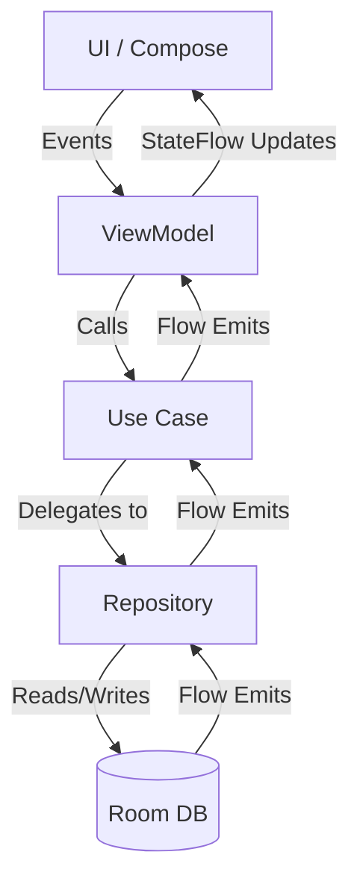

# Architecture 🏗️

UniBox is built using **Clean Architecture** combined with the **MVVM** pattern and **Unidirectional Data Flow (UDF)**.

## Layer Overview

### 1. Presentation Layer
- **Components**: UI screens (Compose), ViewModels, Navigation
- **Responsibility**: Observes UI state from ViewModels, captures user intents.
- **Key Files**: `MainScreen.kt`, `MainViewModel.kt`, `DetailScreen.kt`, `ShareReceiverActivity.kt`

### 2. Domain Layer
- **Components**: Entities, Use Cases, Repository Interfaces
- **Responsibility**: Holds the core business logic. Knows nothing about the outside world.
- **Key Files**: `UniBoxItem.kt` (Model), `UseCases.kt`, `UniBoxRepository.kt`

### 3. Data Layer
- **Components**: Repository Implementations, DAOs, Room Database, Network/Workers
- **Responsibility**: Decides how and where to get data.
- **Key Files**: `UniBoxRepositoryImpl.kt`, `UniBoxDatabase.kt`, `UniBoxItemDao.kt`, `MetadataWorker.kt`

## Unidirectional Data Flow (UDF)
The data flows in a single direction:

See [[Database]] for persistence details.
